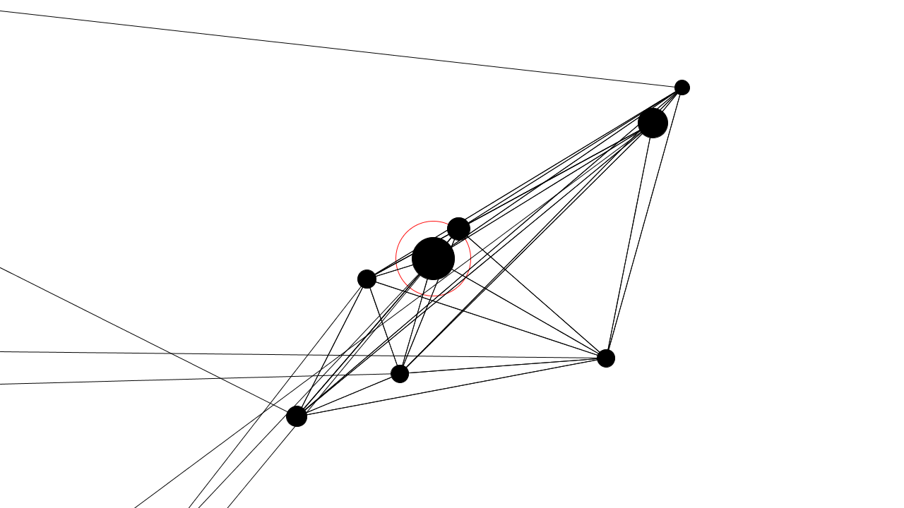
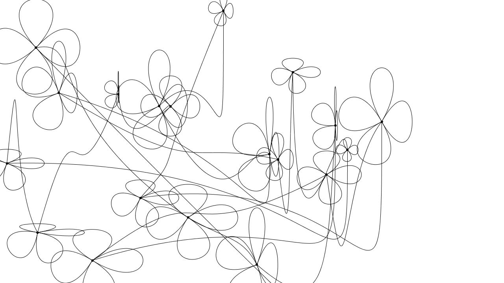
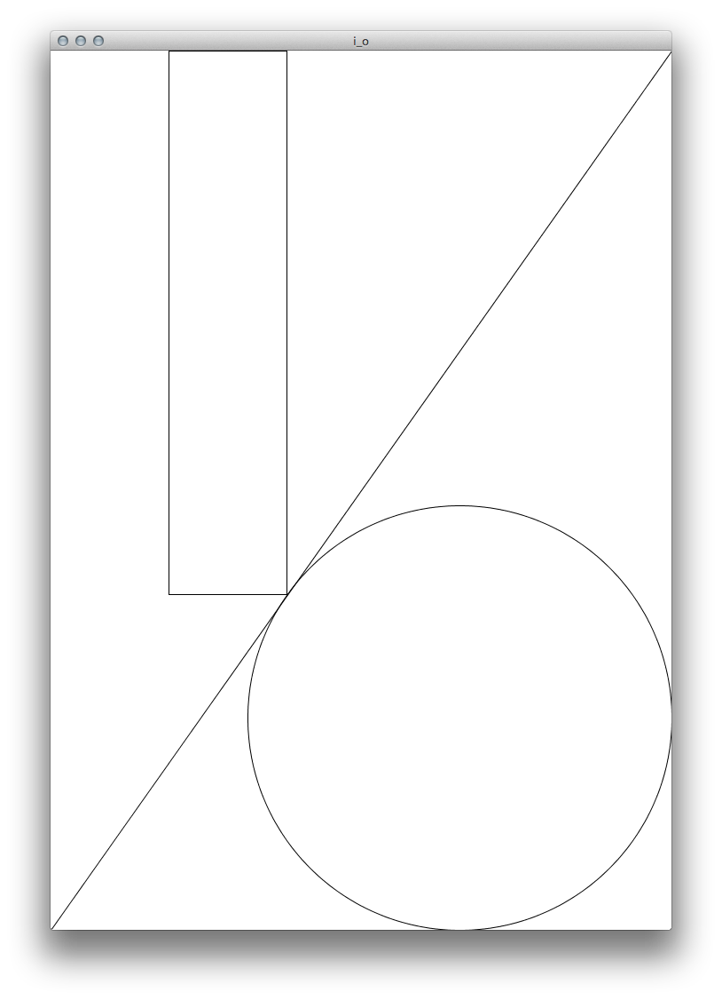
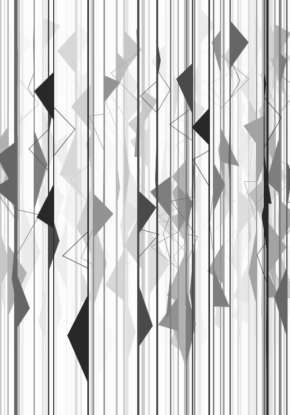
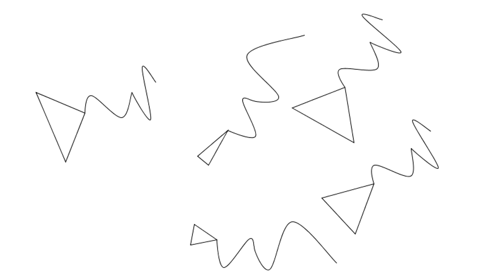
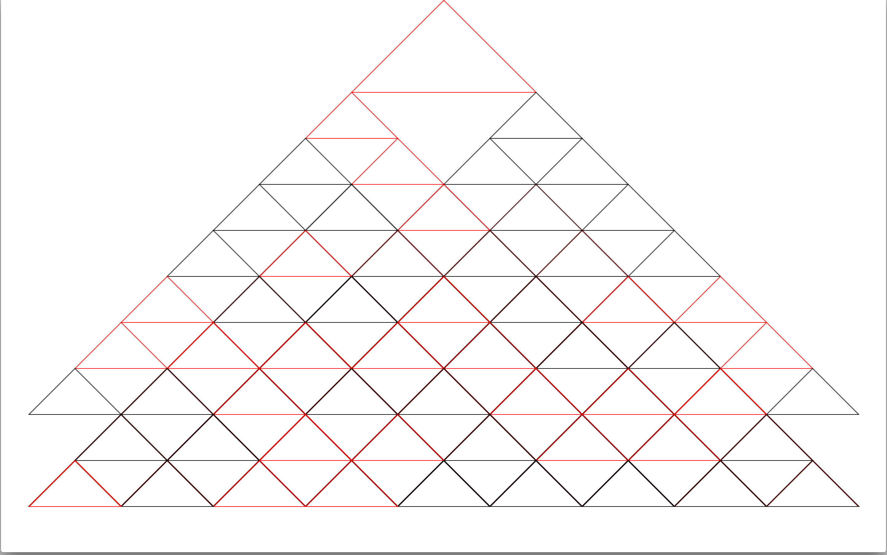

patternprocedure-analog-digital
===============================

These sketches are part of the course ["Eingabe, Ausgabe. Grundlagen der prozessorientierten Gestaltung"](https://incom.org/workspace/4693) by Monika Hoinkis

##davidroettger
  
##thrill2212
  
##wookeeeee
  
##martinlexow
  
##ronleisner
  
##tilokrueger
  
##dueuel
  
##pfingstday
  
##nushin
  
##jonij
  
##tomie89
  
##jensra
  
##lightwaveez
  
##sacred45
  
##dasrehman
  
##ebird-design
  
