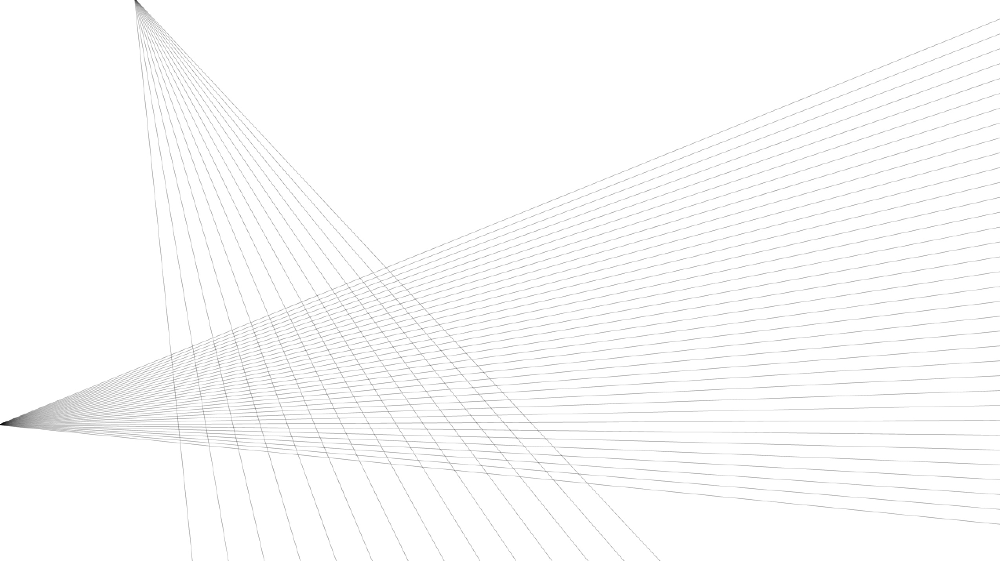

  
#Anweisung Dreieck   
#Wähle drei Punkte an den Rändern eines querliegenden DIN A4 Blattes aus. Zwei der drei Punkte befinden sich dabei auf einer Seite.
Verbinde nun die zwei äußeren Linien ausgehend von dem einzelnen Punkt mit schwarzem Fineliner und Lineal. Fülle nun die Fläche innerhalb der beiden äußeren Linien von dem einzelnen Punkt ausgehend mit weiteren schwarzen Linien gleichen Abstandes.

Wiederhole den Vorgang von einem anderen Rand aus, sodass sich beide Flächen z.T. überkreuzen. Arbeite genau und sauber! 
##Ron Leisner
